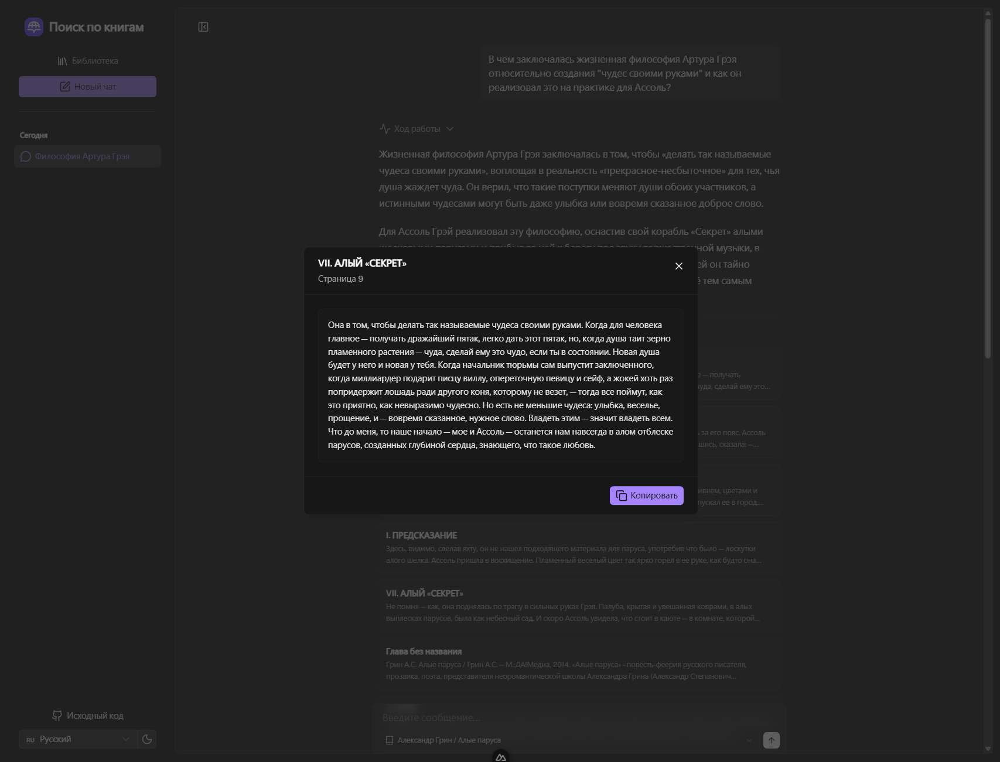

<!-- markdownlint-disable MD033 -->

# 📚 Smart Book Search

[](https://nuxt.com/)
[](https://www.typescriptlang.org/)
[](https://vitest.dev/)
[](https://www.inngest.com/)
[](LICENSE)

Smart Book Search — это современный полнофункциональный сервис для поиска и взаимодействия с содержимым книг с помощью Искусственного Интеллекта.

Проект создан для отборочного этапа ТехноСтрелки 2026.

> [!NOTE]
> Проект получил максимальный балл на отборочном этапе, став лучшим среди всех представленных, однако на финал команда не едет из-за плохого отношения со стороны руководства направляющей организации. Всем прошедшим в финал интересных кейсов и побед!

## ℹ️ О проекте

Сервис позволяет пользователям загружать свои книги и документы, выполнять семантический поиск по их содержимому и вести диалог с ИИ-ассистентом, который опирается на текст первоисточников. Система автоматически извлекает текст, разбивает его на смысловые фрагменты и векторизует для быстрого и точного поиска.

### ✨ Основные возможности

- **Умный Чат:** Ведение диалога с книгой с использованием языковых моделей.
- **Семантический поиск:** Поиск не по ключевым словам, а по смыслу благодаря векторным эмбеддингам.
- **Управление библиотекой:** Загрузка книг в форматах PDF, EPUB и TXT, редактирование метаданных и удаление.
- **Управление библиотекой:** Авторизация с сохранением прав управления книгами и история чатов.
- **Цитаты и обоснование:** Ответы содержат ссылки на конкретные фрагменты текста (цитаты) с указанием глав и страниц.
- **Мультиязычность:** Полная поддержка русского и английского языков (i18n), лёгкое добавление новых.
- **Адаптивный дизайн:** Современный интерфейс на базе Nuxt UI, прекрасно работающий на мобильных устройствах и десктопах.
- **Декомпозиция запросов:** Запрос делится на блоки и перефразируется, что позволяет находить релевантные фрагменты, даже если в вопросе и тексте используются разные формулировки.
- **Админ-панель:** Удобная админ-панель для получения контроля над любыми объектами (чатами, книгами) без нарушения исходного авторства.

### 🛠️ Стек технологий

- **Frontend:** [Nuxt 4](https://nuxt.com/), [Vue 3](https://vuejs.org/), [Nuxt UI](https://ui.nuxt.com/), [Tailwind CSS](https://tailwindcss.com/)
- **ИИ и Эмбеддинги:** [Vercel AI SDK](https://ai-sdk.dev/), [Pinecone](https://www.pinecone.io/)
- **API и Валидация:** [Zod](https://zod.dev/), [Zod-OpenAPI](https://www.npmjs.com/package/zod-openapi)
- **Хранилище файлов:** [Vercel Blob](https://vercel.com/docs/storage/vercel-blob)
- **База данных:** SQLite (через [NuxtHub](https://hub.nuxt.com/)), [Drizzle ORM](https://orm.drizzle.team/)
- **Кеширование и Rate Limits:** [Upstash Redis](https://upstash.com/)
- **Фоновые задачи:** [Inngest](https://www.inngest.com/)

### 🧑‍💻 Управление и DX

- **Опыт разработчка:**  В проекте есть конфигурации для необходимого: IDE, Git, контейнеров, менеджеров пакетов, агентов и другого.
- **Тесты:**  ~100% покрытие качественными тестами.
- **Запуск:**  Запуск одной командой, использование внешних зависимостей только по мере необходимости.
- **Хостинг:**  Готовность к работе как в серверной, так в бессерверной среде.
- **Логгирование:**  Чистые, аккуратные и информативные логи для быстрого отлова ошибок.

---

## ▶️ Демо

Демонстрационную версию можно найти по указанному в описании репозитория адресу.

> [!IMPORTANT]
> Иногда сайты, размещенные на платформе Vercel (включая демонстрационную версию проекта), могут быть недоступны в России из-за сетевых ограничений. Если у вас возникают проблемы с доступом, **используйте VPN или прокси-сервер**.

<!-- -->

> [!TIP]
> При запуске в **Codespaces** всё работает корректно вне зависимости от региона.

## 🗺️ Ориентирование

### 📥 Загрузка и обработка книг

Для просмотра имеющихся книг и загрузки новых реализован раздел "Библиотеки":

1. Перейдите в раздел **Библиотека** с помощью UI или напрямую по ссылке `/library`.
2. Нажмите кнопку «Загрузить книгу» и выберите файл.
3. Проверьте корректность метаданных (название, автор, обложка).
4. Нажмите "Загрузить".
5. После загрузки подготовка книги произойдёт в фоновом режиме.

Благодаря автоматической авторизации, этой книгой сможете управлять только вы.

**Поддерживаемые форматы:**

- **`.txt`** — Полная поддержка согласно требованиям ТЗ.
- **`.epub`** / **`.pdf`**  — Расширенная поддержка.

> [!TIP]
> Мы рекомендуем использовать формат **`.epub`**. Он позволяет системе обеспечивать более высокую точность цитирования и лучшее понимание контекста благодаря более точной разметке. Это не обязательно, другие форматы тоже обрабатываются отлично.

### 💡 Примеры работы

Система отлично отвечает на все вопросы пользователей — даже на самые сложные.

#### **Анализ мотивации и философии (Книга: «Алые паруса»)**

- **Вопрос:** В чем заключалась жизненная философия Артура Грэя относительно создания "чудес своими руками" и как он реализовал это на практике для Ассоль?

- **Ответ:**
Жизненная философия Артура Грэя заключалась в том, чтобы «делать так называемые чудеса своими руками», воплощая в реальность «прекрасное-несбыточное» для тех, чья душа жаждет чуда. Он верил, что такие поступки меняют души обоих участников, а истинными чудесами могут быть даже улыбка или вовремя сказанное доброе слово.
Для Ассоль Грэй реализовал эту философию, оснастив свой корабль «Секрет» алыми шелковыми парусами и прибыв за ней к берегу под звуки торжественной музыки, в точности исполнив старое предсказание. Кроме того, перед их встречей он тайно оставил на пальце спящей девушки свое лучистое кольцо, став для неё тем самым «принцем», которого она ждала долгие годы.

- **Цитаты:** Выведены релевантные цитаты, первая из них из главы VII, страница 9.

<details>
<summary>📸 Посмотреть скриншот примера</summary>




</details>

#### **Детализация и сопоставление персонажей (Книга: «Недоросль»)**

- **Вопрос:** Опиши систему обучения Митрофана: каким именно наукам его учили, кто были его учителя и как оценивали его успехи Стародум и Правдин?

- **Ответ:**
Митрофана обучали грамоте (дьячок Кутейкин), арифметике (отставной сержант Цыфиркин) и «всем наукам», включая французский, под руководством немца Вральмана, который на самом деле был бывшим кучером. Успехи юноши в науках ничтожны: он не знает географии, а в грамматике считает слово «дверь» прилагательным, так как она «приложена» к своему месту. Правдин иронично отзывается о его знаниях, замечая, что в грамматике тот «силен». Стародум же оценивает результаты такого обучения как «злонравия достойные плоды», считая, что невежды-учителя лишь развращают душу «недоросля».

- **Цитаты:** Система корректно нашла разбросанные по тексту факты и вывела их в порядке значимости. Первая цитата из пятого действия, страница 8.

<details>
<summary>📸 Посмотреть скриншот примера</summary>


</details>

#### **Честный ответ при отсутствии данных (Книга: «Пиковая дама»)**

- **Вопрос:** Как звали отца Германна, от которого герой унаследовал свой небольшой капитал?

- **Ответ:**
К сожалению, в тексте книги я не нашёл ответа на этот вопрос. В предоставленных фрагментах упоминается лишь то, что Германн был сыном обрусевшего немца, который оставил ему маленький капитал. Имя его отца в тексте не приводится.

- **Цитаты:** Семантический поиск корректно выдал наиболее близкие по смыслу фрагменты текста (упоминания отца, получение капитала).

<details>
<summary>📸 Посмотреть скриншот примера</summary>


</details>

#### **Поиск фрагментов (Книга: «Шинель»)**

- **Вопрос:** Найди фрагменты, где описывается процесс жесткой экономии Акакия Акакиевича ради новой шинели: от чего именно ему пришлось отказаться в быту?

- **Ответ:**
Для того чтобы накопить на новую шинель, Акакий Акакиевич решил существенно сократить свои повседневные расходы. Согласно тексту, он отказался от употребления чая и свечей по вечерам, предпочитая работать при свете свечи своей хозяйки. Чтобы сберечь подметки, он старался ходить по улицам «почти на цыпочках», а для экономии белья реже отдавал его прачке и дома оставался в одном только старом халате. Как описывается во фрагменте 14, он даже «приучился голодать по вечерам», заменяя обычную пищу мечтами о будущей шинели.

- **Цитаты:** Система нашла отличные примеры в тексте. Указанный моделью пример — страница 3.

<details>
<summary>📸 Посмотреть скриншот примера</summary>


</details>

## 🚀 Автоматический деплой

[](https://vercel.com/new/clone?repository-url=https%3A%2F%2Fgithub.com%2Fgeorgij-spiridonov%2Fsmart-book-search&env=AI_GATEWAY_API_KEY,PINECONE_API_KEY,PINECONE_INDEX,PINECONE_HOST,BOOKS_BLOB_READ_WRITE_TOKEN,KV_REST_API_URL,KV_REST_API_TOKEN,INNGEST_EVENT_KEY,INNGEST_SIGNING_KEY,TURSO_AUTH_TOKEN,TURSO_DATABASE_URL,NUXT_SESSION_PASSWORD,ADMIN_PASSWORD)

## ⚙️ Локальная разработка

### Готовое окружение (GitHub Codespaces)

[](https://codespaces.new/georgij-spiridonov/smart-book-search)

### Ручная настройка

#### 1. Установка зависимостей

Убедитесь, что у вас установлен Node.js (рекомендуется v22+). Клонируйте репозиторий и установите зависимости:

```bash
npm install
```

#### 2. Переменные окружения

Для работы приложения требуются сторонние сервисы. Скопируйте файл конфигурации `.env.example` в `.env`:

```bash
cp .env.example .env
```

Заполните `.env` вашими актуальными ключами доступа:

- **Vercel AI Gateway:** `AI_GATEWAY_API_KEY`
- **Pinecone:** `PINECONE_API_KEY`, `PINECONE_INDEX`, `PINECONE_HOST`
- **Vercel Blob:** `BOOKS_BLOB_READ_WRITE_TOKEN`
- **Upstash Redis:** `KV_REST_API_URL`, `KV_REST_API_TOKEN`
- **Inngest:** `INNGEST_EVENT_KEY`, `INNGEST_SIGNING_KEY`
- **Turso Database:** `TURSO_AUTH_TOKEN`, `TURSO_DATABASE_URL`
- **Auth Utils:** `NUXT_SESSION_PASSWORD` (произвольная строка)
- **Admin Password:** `ADMIN_PASSWORD` (пароль для входа в панель управления)

#### 3. Запуск сервера для разработки

Запустите локальный сервер (по умолчанию доступен на `http://localhost:3000`):

```bash
npm run dev
```

## 🚀 Команды разработки

| Команда                      | Описание                                                 |
| :--------------------------- | :------------------------------------------------------- |
| `npm run dev`                | Запуск сервера разработки Nuxt                           |
| `npm run build`              | Сборка приложения для production                         |
| `npm run test`               | Запуск всех тестов (Vitest)                              |
| `npm run lint`               | Проверка кода линтером (ESLint)                          |
| `npm run typecheck`          | Проверка типов TypeScript                                |
| `npx inngest-cli@latest dev` | Запуск локального Inngest Dev Server (для фоновых задач) |

---

## 📖 API Документация

Проект автоматически генерирует интерактивную документацию OpenAPI:

- **Интерактивная документация API:** `/api/docs`
- **Спецификация OpenAPI (JSON):** `/api/openapi`

## 📄 Лицензия

Проект распространяется под лицензией MIT. Подробности см. в файле [LICENSE](LICENSE).
